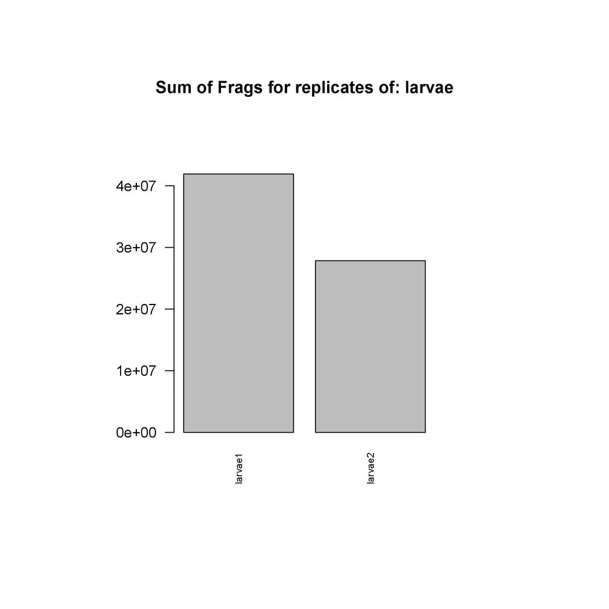
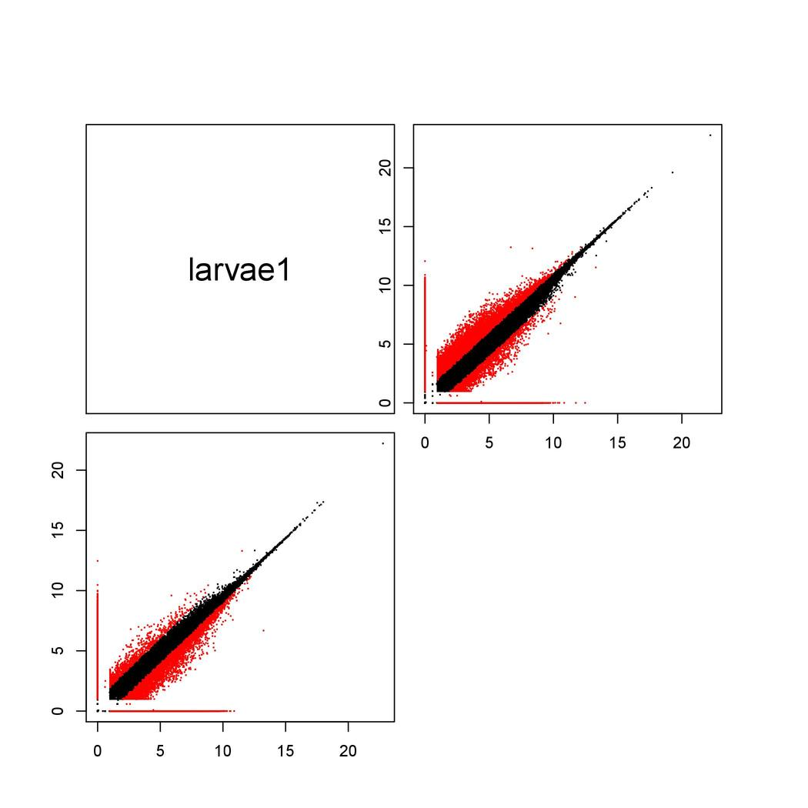
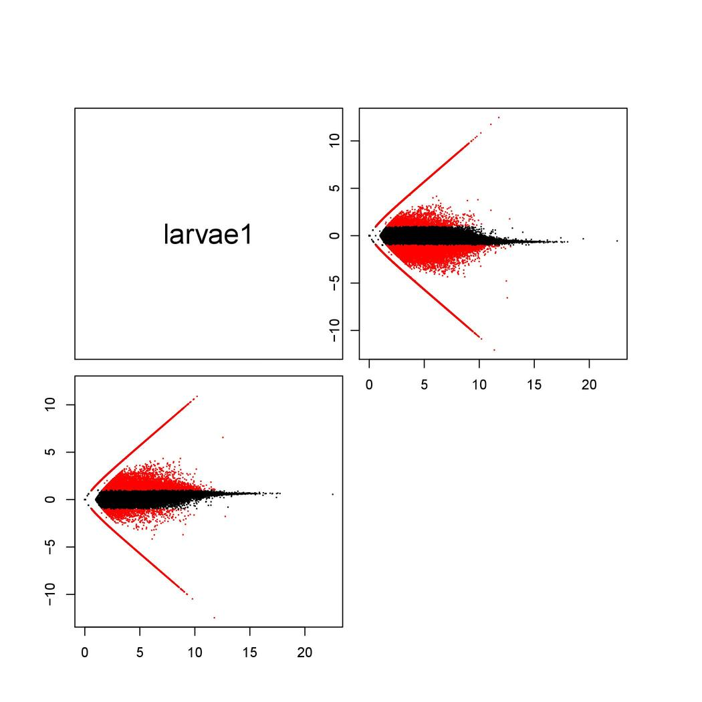
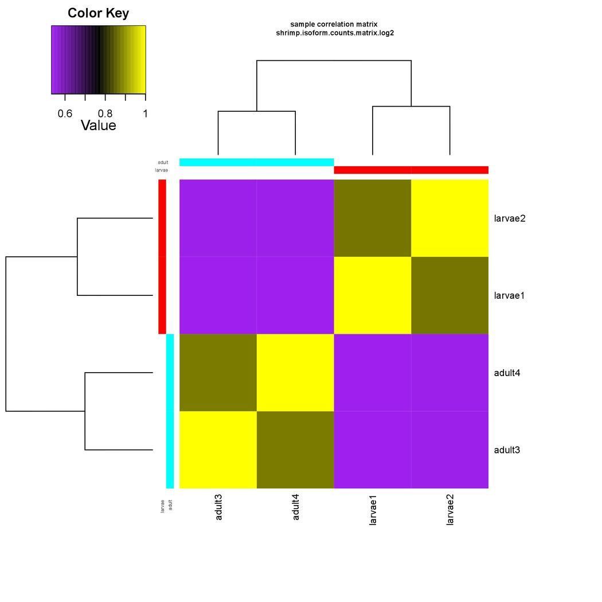

<h1 align="center">Differential Expression with Trinity on Marconi<a id="top"></a></h1>

<h2 align="center">Comparison of Replicates</h2>

<p>If our data contains replicates such as with the shrimp data we should first compare the replicates before caculating differential expression.  In the DifferentialExpression directory run the following script.</p>

```
#!/bin/bash -l
#PBS -q haswell
#PBS -N comparereplicates
#PBS -l nodes=1:ppn=1
#PBS -l walltime=00:05:00
#PBS -o out.txt
#PBS -e err.txt

cd /home/nbumpus/shrimp/DifferentialExpression/isoform/

module load trinity/2.8.4
module load R/3.5.2

$TRINITY_HOME/Analysis/DifferentialExpression/PtR \
-m /home/nbumpus/shrimp/abundances/matrix/shrimp.isoform.counts.matrix \
-s /home/nbumpus/shrimp/samples_described.txt \
--log2 \
--compare_replicates
```
<p>This will produce a pdf file containing MA plots, volcano plots and a histogram depicting the comparison of replicates.  Below is shown the results for the larvae replicates.  We should have similar plots for the adult replicates.</p>

<h2 align="center">Replicate Counts for Larvae</h2>

<p align="center">
  
</p>

<h2 align="center">Scatter plots for Larvae</h2>

<p align="center">
  
</p>

<h2 align="center">MA Plots for Larvae</h2>

<p align="center">
  
</p>

<h2 align="center">Heatmap for Larvae</h2>

<p align="center">
  
</p>

<p>Next we can compare the replicates across all of the samples by running the following script in the DifferentialExpression directory and viewing the heatmap.</p>

```
#!/bin/bash -l
#PBS -q haswell
#PBS -N comparesamples
#PBS -l nodes=1:ppn=1
#PBS -l walltime=01:00:00
#PBS -o out.txt
#PBS -e err.txt

cd /home/nbumpus/shrimp/DifferentialExpression/isoform/

module load trinity/2.8.4
module load R/3.5.2

$TRINITY_HOME/Analysis/DifferentialExpression/PtR \
-m /home/nbumpus/shrimp/abundances/matrix/shrimp.isoform.counts.matrix \
-s /home/nbumpus/shrimp/samples_described.txt \
--log2 \
--sample_cor_matrix
```

<p>The resulting heatmap will be a file named shrimp.isoform.counts.matrix.log2.sample_cor_matrix.pdf.  It should look something like this</p>

<p align="center">
  
</p>


```
larvae  larvae1
larvae  larvae2
adult   adult3
adult   adult4
```

<p>Next make a new directory within the project directory called DifferentialExpression and use the following script to determine Differential Expression.</p>

```
#!/bin/bash -l
#PBS -q bio
#PBS -N shr-DE-iso
#PBS -l nodes=1:ppn=1
#PBS -l walltime=02:00:00
#PBS -o out.txt
#PBS -e err.txt

cd #PBS_O_WORKDIR

module load trinity/2.8.4
module load R/3.5.2

$TRINITY_HOME/Analysis/DifferentialExpression/run_DE_analysis.pl \
--matrix /home/nbumpus/shrimp/abundances/matrix/shrimp.isoform.counts.matrix \
--method edgeR \
--samples_file /home/nbumpus/shrimp/samples_described.txt \
--output /home/nbumpus/shrimp/DifferentialExpression/isoform/
```
<p>Note that this script calculates the differential expression at the isoform level.  You can also calculate differential expression at the gene level by using the shrimp.gene.counts.matrix and output to a new gene folder within the DifferentialExpression directory.  For the yeast data add the --dispersion 0.1 argument after the --method edgeR argument.  The output will give a set of differentially expressed isoforms, sets of up-regulated isoforms and MA and volcano plots describing differential expression between all pairwise comparisons.  Below are the MA and volcano plots for the shrimp data</p>


<h2 align="center">Table of Contents<a id="contents"></a></h2>
* [Home](README.md)
* [Obtaining Data](data.md)
* [Data Quality](dataqc.md)
* [Building an Assembly](assembly.md)
* [Abundance Estimation](abundance.md)
* [Assembly Quality](assemblyqc.md)
* [Differential Expression](DE.md)
