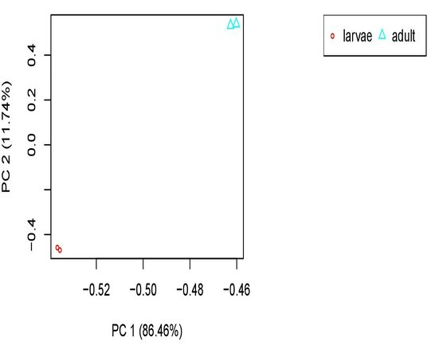
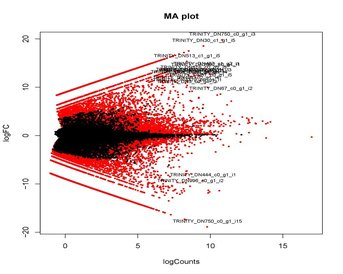
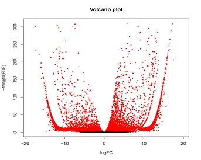

<h1 align="center">Differential Expression with Trinity on Marconi<a id="top"></a></h1>

<h2 align="center">Comparison of Replicates</h2>

<p>If our data contains replicates such as with the shrimp data we should first compare the replicates before caculating differential expression.  First, in the shrimp project directory make a new directory called DifferentialExpression.  Note that here we have to decide whether we want to determine differential expression at the isoform or gene level.  To demonstrate I will determine differential expression at the isoform level but all of the scripts can be repeated at the gene level using the appropriate files as well.  Firs we need to make a tab delimited file describing the sample to replicate relationships.  Since we only have four samples use nano to create a samples_described.txt file in the shrimp project directory like this.</p>


```
larvae  larvae1
larvae  larvae2
adult   adult3
adult   adult4
```

<p>Make a new isoform directory inside of the DifferentialExpression directory. Then run the following script from within the isoform directory.</p>

```
#!/bin/bash -l
#PBS -q haswell
#PBS -N comparereplicates
#PBS -l nodes=1:ppn=1
#PBS -l walltime=00:05:00
#PBS -o out.txt
#PBS -e err.txt

cd /home/nbumpus/shrimp/DifferentialExpression/isoform/

module load trinity/2.8.4
module load R/3.5.2

$TRINITY_HOME/Analysis/DifferentialExpression/PtR \
-m /home/nbumpus/shrimp/abundances/matrix/shrimp.isoform.counts.matrix \
-s /home/nbumpus/shrimp/samples_described.txt \
--log2 \
--compare_replicates
```
<p>This will produce pdf's of a histogram of counts per replicate, scatter plots for each replicate, MA plots for each replicate and a heatmap.  Shown below are the counts histogram, scatter plots and MA plots for the larvae replicates.  The plots should be simmilar for the adult replicates.</p>

<p>
  
  
  
</p>

<p>Next run the following script to generate a heatmap of all of the combined samples and replicates.</p>

```
#!/bin/bash -l
#PBS -q haswell
#PBS -N comparesamples
#PBS -l nodes=1:ppn=1
#PBS -l walltime=01:00:00
#PBS -o out.txt
#PBS -e err.txt

cd /home/nbumpus/shrimp/DifferentialExpression/isoform/

module load trinity/2.8.4
module load R/3.5.2

$TRINITY_HOME/Analysis/DifferentialExpression/PtR \
-m /home/nbumpus/shrimp/abundances/matrix/shrimp.isoform.counts.matrix \
-s /home/nbumpus/shrimp/samples_described.txt \
--log2 \
--sample_cor_matrix
```

<p>Shown below are the heatmaps for the larvae, adult and all combined samples and replicates.</p>
 
<p>
  
  
  
</p>

<p>We can also perform a principal components analysis to visualze the variation between samples and replicates.  Perform the principle components analysis by running the following script.</p>

```
#!/bin/bash -l
#PBS -q haswell
#PBS -N pc
#PBS -l nodes=1:ppn=1
#PBS -l walltime=00:05:00
#PBS -o out.txt
#PBS -e err.txt

cd /home/nbumpus/shrimp/DifferentialExpression/isoform/

module load trinity/2.8.4
module load R/3.5.2

$TRINITY_HOME/Analysis/DifferentialExpression/PtR \
-m /home/nbumpus/shrimp/abundances/matrix/shrimp.isoform.counts.matrix \
-s /home/nbumpus/shrimp/samples_described.txt \
--log2 \
--CPM \
--prin_comp 2
```

<p>This should produce the following plot shown below.</p>

<p align="center">
  
</p>

<h2 align="center">Calcultating Differential Expression</h2>

<p>We can now calculate differential expression for the shrimp data set using whichever R package was earlier installed (edgeR, DESeq2 or limma).  I used edgeR for the data sets.  Use the following script to calculate the differential expression for the shrimp data set.</p>

```
#!/bin/bash -l
#PBS -q bio
#PBS -N shr-DE-iso
#PBS -l nodes=1:ppn=1
#PBS -l walltime=02:00:00
#PBS -o out.txt
#PBS -e err.txt

cd #PBS_O_WORKDIR

module load trinity/2.8.4
module load R/3.5.2

$TRINITY_HOME/Analysis/DifferentialExpression/run_DE_analysis.pl \
--matrix /home/nbumpus/shrimp/abundances/matrix/shrimp.isoform.counts.matrix \
--method edgeR \
--samples_file /home/nbumpus/shrimp/samples_described.txt \
--output /home/nbumpus/shrimp/DifferentialExpression/isoform/
```
<p>For the yeast data add the --dispersion 0.1 argument after the --method edgeR argument.  The output will give a set of differentially expressed isoforms, sets of up-regulated isoforms and MA and volcano plots describing differential expression between all pairwise comparisons.  Below are the MA and volcano plots for the shrimp data</p>

<p>
  
  
</p>


<h2 align="center">Table of Contents<a id="contents"></a></h2>
* [Home](README.md)
* [Obtaining Data](data.md)
* [Data Quality](dataqc.md)
* [Building an Assembly](assembly.md)
* [Abundance Estimation](abundance.md)
* [Assembly Quality](assemblyqc.md)
* [Differential Expression](DE.md)
