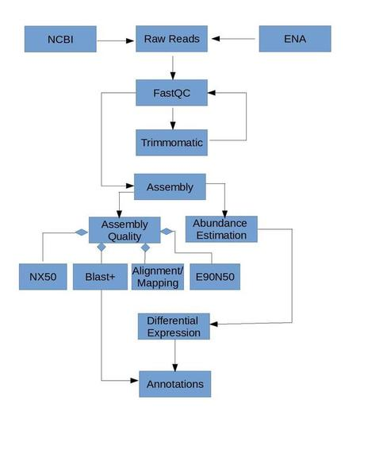

<h1 align="center"> De Novo Transcriptome Assembly Using Trinity 2.8.4 on Marconi</h1>
This project focussed on the use of Trinity software on Marconi in developing de novotranscriptome assemblies.  RNA seq data for yeast, lobster, and shrimp were used to develop a general workflow.  The lobster and shrimp data sets are publicly available from NCBI and ENA.Instructions for downloading the yeast data set can be found in the original trinity paper from 2013 in Nature. Below is a schematic of the general developed workflow for generating de novo transcriptome assemblies.

<p align="center">
   
</p>
<h2 align="center">Table of Contents</h2>
* [Obtaining Data](data.html)
* <a href="https://github.com/nathanbumpus/nathanbumpus.io/dataqc.md">Data Quality</a>
* <a href="https://github.com/nathanbumpus/nathanbumpus.io/assembly.md">Building and Assembly</a>
<a href="https://github.com/nathanbumpus/nathanbumpus.io/abundances.md">Abundance Estimation</a>
<a href="https://github.com/nathanbumpus/nathanbumpus.io/asemblyqc.md">Assembly Quality</a>
<a href="https://github.com/nathanbumpus/nathanbumpus.io/DE.md">Differential Expression</a>


## Welcome to GitHub Pages

You can use the [editor on GitHub](https://github.com/nathanbumpus/nathanbumpus.githup.io/edit/master/README.md) to maintain and preview the content for your website in Markdown files.

Whenever you commit to this repository, GitHub Pages will run [Jekyll](https://jekyllrb.com/) to rebuild the pages in your site, from the content in your Markdown files.

### Markdown

Markdown is a lightweight and easy-to-use syntax for styling your writing. It includes conventions for

```markdown
Syntax highlighted code block


## Header 2
### Header 3

- Bulleted
- List

1. Numbered
2. List

**Bold** and _Italic_ and `Code` text

[Link](url) and 
```

For more details see [GitHub Flavored Markdown](https://guides.github.com/features/mastering-markdown/).

### Jekyll Themes

Your Pages site will use the layout and styles from the Jekyll theme you have selected in your [repository settings](https://github.com/nathanbumpus/nathanbumpus.githup.io/settings). The name of this theme is saved in the Jekyll `_config.yml` configuration file.

### Support or Contact

Having trouble with Pages? Check out our [documentation](https://help.github.com/categories/github-pages-basics/) or [contact support](https://github.com/contact) and we’ll help you sort it out.
