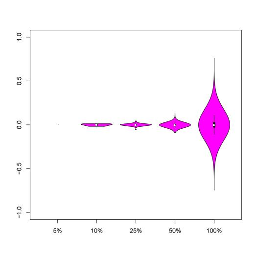
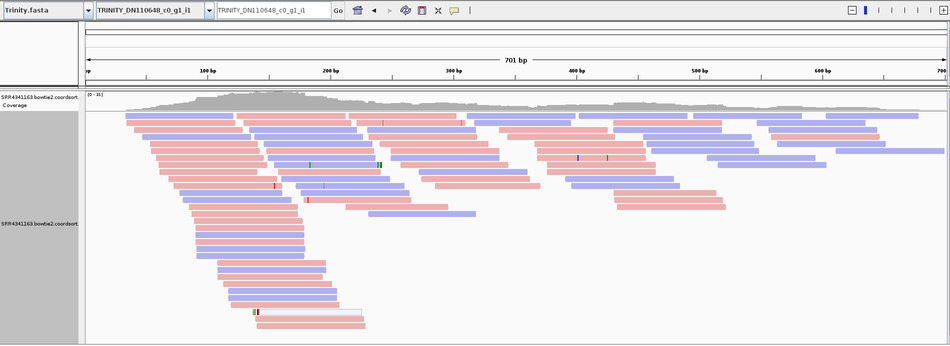
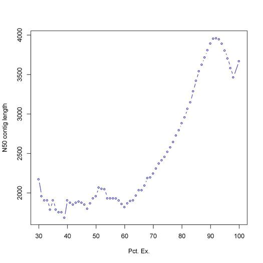

<h1 align="center"><a id="top"></a>Evaluation of Assembly Quality</h1>

<p>Once transcript abundance estimates have been obtained there are a number of tools we can use to determine if our assemblies are acceptable for downstream analysis.  These include the generation of the N50 statistic, <a href="#align">realigning the reads back to the assemblies</a>, determining <a href="#specificity">strand specificity</a> (if not already done), <a href="#blast">building a blastable database and blasting the assemblies</a> and <a href="#Ex90N50">evaluating the Ex90N50 statistic.</a>  First go to the shrimp project directory and make a new directory called assembly_quality.<a href="#contents">Table of Contents</a></p>

<h2 align="center">Generation of the N50 statistic</h2>

<p>To generate the Nx50 statistic for the shrimp data run the following script.</p>

```
#!/bin/bash -l
#PBS -q bio
#PBS -N AssemblyStats
#PBS -l nodes=1:ppn=1
#PBS -l walltime=00:05:00
#PBS -o /home/nbumpus/shrimp/assembly_quality/assembly_stats.txt
#PBS -e err.txt

cd #PBS_O_WORKDIR

module load trinity/2.8.4

$TRINITY_HOME/util/TrinityStats.pl \
/home/nbumpus/shrimp/trinity_out_dir/Trinity.fasta
```

<p>This will generate the assembly_stats.txt file that looks something like this.</p>

```

################################
## Counts of transcripts, etc.
################################
Total trinity 'genes':  124180
Total trinity transcripts:	186206
Percent GC: 39.17

########################################
Stats based on ALL transcript contigs:
########################################

        Contig N10: 9401
        Contig N20: 7201
        Contig N30: 5808
        Contig N40: 4663
        Contig N50: 3673

        Median contig length: 460
        Average contig: 1372.72
        Total assembled bases: 255608356


#####################################################
## Stats based on ONLY LONGEST ISOFORM per 'GENE':
#####################################################

        Contig N10: 7728
        Contig N20: 5416
        Contig N30: 3974
        Contig N40: 2908
        Contig N50: 2050

        Median contig length: 362
        Average contig: 876.75
        Total assembled bases: 108874612

```
<p>If we look at only the longest isoform per gene and line up all of our assembled contigs by decreasing length the N50 is the length of the contig at the at the point of coverage at 50 percent of the length of the total assembly.<a href="#top">back to top </a><a href="#contents">table of contents</a></p>

<h2 align="center">Realigning the Reads Back to the Assembly<a id="align"></a></h2>

<p>To map the reads back to the assembly we can use Bowtie2/2.3.4.3 on Marconi.  First build a Bowtie2 index.</p>

```
#!/bin/bash -l
#PBS -q bio
#PBS -N Bowtie2-build
#PBS -l nodes=1:ppn=1
#PBS -l walltime=02:00:00
#PBS -o out.txt
#PBS -e err.txt

cd #PBS_O_WORKDIR

module load Bowtie2/2.3.4.3

bowtie2-build /home/nbumpus/shrimp/trinity_out_dir/Trinity.fasta \
/home/nbumpus/shrimp/assembly_quality/shrimp_ref
```
<p>Then align each set of reads back to the assembly modifying the following script as necessary for each pair of left and right reads</p>

```
#!/bin/bash -l
#PBS -q bio
#PBS -N bowtie2-shrimp1
#PBS -l nodes=1:ppn=5
#PBS -l walltime=05:00:00
#PBS -o out.txt
#PBS -e err.txt

cd #PBS_O_WORKDIR

module load perl
module load Bowtie2/2.3.4.3
module load samtools

bowtie2 -p 4 -q \
--no-unal -k 20 -x /home/nbumpus/shrimp/assembly_quality/shrimp_ref \
-1 /home/nbumpus/shrimp/trinity_reads/SRR4341161_1.trim.paired.adj.fastq \
-2 /home/nbumpus/shrimp/trinity_reads/SRR4341161_2.trim.paired.adj.fastq \
2>/home/nbumpus/shrimp/assembly_quality/SRR4341161_align_stats.txt| \
samtools view -@4 -Sb \
-o /home/nbumpus/shrimp/assembly_quality/SRR4341161.bowtie2.bam
```
<p>This script tell Bowtie2 to use 4 threads and when aligning the fastq files (-q), then suppress SAM records for all unaligned reads and to report up to 20 alignments per read.  The results are written to an align_stats.txt file and piped to samtools to create a bam file.  The thread count from Bowtie2 is also piped to samtools and should be less than or equal to the ppn in the Torque settings.  We then specify that the output file should be .bam.</p>

<p>If we open the align_stats.txt file we will see something like this.</p>

```
45248026 reads; of these:
  45248026 (100.00%) were paired; of these:
    3135976 (6.93%) aligned concordantly 0 times
    15302515 (33.82%) aligned concordantly exactly 1 time
    26809535 (59.25%) aligned concordantly >1 times
    ----
    3135976 pairs aligned concordantly 0 times; of these:
      543470 (17.33%) aligned discordantly 1 time
    ----
    2592506 pairs aligned 0 times concordantly or discordantly; of these:
      5185012 mates make up the pairs; of these:
        2010855 (38.78%) aligned 0 times
        414129 (7.99%) aligned exactly 1 time
        2760028 (53.23%) aligned >1 times
97.78% overall alignment rate
```
<p>This file tells us that ~93% of the reads from this sample aligned concordantly at least one time.  Bowtie2 then took the ~7% of the reads that did not align concordantly and tried to align them discordantly.  Bowtie2 was able to align ~17 percent of these reads discordantly.  Bowtie2 then attempted to align the remaining unaligned reads to the assembly as singletons and was successful with about 61% of these reads.  This gives an overall alignment rate of ~98%.  The mapping shown is an example of a sucessful alignment showing greater than 70% of the reads aligning concordantly and a high overall alignment rate greater than 80%. <a href="#top">back to top </a><a href="#contents">table of contents</a></p>

<h2 align="center">Determining Strand Specificity<a id="specificity"></a></h2>

<p>Usually a paper will tell you how the cDNA library was constructed and you can deduce strand specificity.  Such is the case with the lobster and yeast papers.  Sometimes, however, this information is not provided in the literature.  In the case of the shrimp paper we are not provided with the method as to how the library was constructed.  There are two things we can do in this scenario.  We can pick a genome of a closely related species and visualize the mappings of the reads back to that genome using IGV.  The other option is to build the assembly in the manner that we think the library was probably constructed, examine the specificity violin plots and then use IGV to visualize the mappings to the assembly.  Since we have already constructed an assembly for the shrimp data let's pursue the second option.  First run the following trinity script.</p>

```
#!/bin/bash -l
#PBS -q bio
#PBS -N shrimp-str-spec
#PBS -l nodes=1:ppn=10
#PBS -l walltime=12:00:00
#PBS -o out.txt
#PBS -e err.txt

cd #PBS_O_WORKDIR

module load trinity/2.8.4
module load samtools

$TRINITY_HOME/util/misc/run_bowtie2.pl \
--target /home/nbumpus/shrimp/trinity_out_dir/Trinity.fasta \
--left /home/nbumpus/shrimp/trinity_reads/reads.all.left.fastq \
--right /home/nbumpus/shrimp/trinity_reads/reads.all.right.fastq \
--CPU 10 \
| samtools view -@10 -Sb - \
| samtools sort -@10 - -o /home/nbumpus/shrimp/assembly_quality/specificity.bowtie2.coordSorted.bam
```
<p>We want to use all of the combined reads for this script to produce a coordinate sorted bam file for the second script.  The CPUS can be piped to samtools and should match the ppn Torque settings.  Next, run the following script to examine strand specificity</p>

```
#!/bin/bash -l
#PBS -q bio
#PBS -N shr-vio-plt-spec
#PBS -l nodes=1:ppn=1
#PBS -l walltime=10:00:00
#PBS -o out.txt
#PBS -e err.txt

cd #PBS_O_WORKDIR

module load trinity/2.8.4
module load R/3.5.2

$TRINITY_HOME/util/misc/examine_strand_specificity.pl \
/home/nbumpus/shrimp/assembly_quality/specificity.bowtie2.coordSorted.bam \
/home/nbumpus/shrimp/assembly_quality/pooled
```
<p>We should get a pooled.dat table containing a diff_ratio for each of the transcripts and a pdf containing violin plots depicting this graph.  The pdf can be sftp'd to your computer and viewed.  For the shrimp data we should get a plot similar to this.</p>

<p align="center">
   
</p>

<p>The plot shows that as we approach the 100% of the total reads the median diff_ration is right around 0.0 with a high distribution of the reads centered around that median.  This suggests that the library is non-strand specific.  Results for the lobster and yeast data are shown in the powerpoint slides.  We can now use IGV to back up the assertion that the data is non-strand specific.</p>

<h2 align="center">Determining Strand Specificity With IGV</h2>

<p>We can use IGV to visualize how each set of reads is mapping back to our assembly to help determine strand specificity.  Begin by running the following script.</p>

```
#!/bin/bash -l
#PBS -q bio
#PBS -N total-igv
#PBS -l nodes=1:ppn=8
#PBS -l walltime=03:00:00
#PBS -o out.txt
#PBS -e err.txt

cd #PBS_O_WORKDIR

module load samtools

samtools sort -@8 /home/nbumpus/shrimp/assembly_quality/SRR4341161.bowtie2.bam \
-o /home/nbumpus/shrimp/assembly_quality/SRR4341161.bowtie2.coordsort.bam
samtools sort -@8 /home/nbumpus/shrimp/assembly_quality/SRR4341162.bowtie2.bam \
-o /home/nbumpus/shrimp/assembly_quality/SRR4341162.bowtie2.coordsort.bam
samtools sort -@8 /home/nbumpus/shrimp/assembly_quality/SRR4341163.bowtie2.bam \
-o /home/nbumpus/shrimp/assembly_quality/SRR4341163.bowtie2.coordsort.bam
samtools sort -@8 /home/nbumpus/shrimp/assembly_quality/SRR4341164.bowtie2.bam \
-o /home/nbumpus/shrimp/assembly_quality/SRR4341164.bowtie2.coordsort.bam
samtools index /home/nbumpus/shrimp/assembly_quality/SRR4341161.bowtie2.coordsort.bam
samtools index /home/nbumpus/shrimp/assembly_quality/SRR4341162.bowtie2.coordsort.bam
samtools index /home/nbumpus/shrimp/assembly_quality/SRR4341163.bowtie2.coordsort.bam
samtools index /home/nbumpus/shrimp/assembly_quality/SRR4341164.bowtie2.coordsort.bam
samtools faidx /home/nbumpus/shrimp/trinity_out_dir/Trinity.fasta
```
<p>This script uses samtools to first create the coordinate sorted bam files for all of the reads, then index the coordinate sorted bam files and then index the assembly.  These files can then be sftp'd to your computer and viewed in IGV.  In IGV color the alignments as first-of-pair-strand.  If we pick an area of dense coverage we will see something like the following</p>

<p align="center">
   
</p>

<p>If this were a strand specific library the reads would be all or mostly the same color.  This supports the assertion that the data is non-strand specific and we constructed the assembly with the correct parameters.<a href="#top">back to top </a><a href="#contents">table of contents</a></p>

<h2 align="center">Evaluating the Quality of Transcripts<a id="blast"></a></h2>

<p>When working with a non-model organism one way to evaluate the quality of the transcripts is to see how well the transcripts map back to a database of known proteins.  On Marconi we can use the Blast+ module to perform this task by using any downloadable database that we want.  I will use the uniprot swissprot database to demonstrate this.  First download the current fasta file.  You can get it here <a href="https://www.uniprot.org/downloads#uniprotkblink" target="_blank">uniprot downloads</a> In your home directory on Marconi make a new directory called databases.  Sftp the downloaded file from your computer to the databases directory on Marconi and unzip the file.  Next run the following script to build the database.</p>

```
#!/bin/bash -l
#PBS -q bio
#PBS -N builddb
#PBS -l nodes=1:ppn=1
#PBS -l walltime=00:05:00
#PBS -o out.txt
#PBS -e err.txt

cd #PBS_O_WORKDIR

module load blast+

makeblastdb -in /home/nbumpus/databases/uniprot_sprot.fasta \
-dbtype prot
```
<p>Now blast the transcripts against the database like so.</p>
```

!/bin/bash -l
#PBS -q bio
#PBS -N blast-pooled
#PBS -l nodes=1:ppn=16
#PBS -l walltime=48:00:00
#PBS -o out.txt
#PBS -e err.txt

cd #PBS_O_WORKDIR

module load blast+

blastx \
-query /home/nbumpus/shrimp/trinity_out_dir/Trinity.fasta \
-db /home/nbumpus/databases/uniprot_sprot.fasta \
-out /home/nbumpus/shrimp/assembly_quality/pooled.blastx.outfmt6 \
-evalue 1e-20 \
-num_threads 16 \
-max_target_seqs 1 \
-outfmt 6
```
<p>This tells blast+ to set a threshold for saving hits at 1e-20, use 16 threads, keep a maximum of one aligned sequence and format the output in tabular format. More options can be seen by loading the blast+ module in the terminal and typing blastx -help</p>

<p>Next run the following script</p>

```
#!/bin/bash -l
#PBS -q bio
#PBS -N blastcoverage
#PBS -l nodes=1:ppn=1
#PBS -l walltime=00:05:00
#PBS -o out.txt
#PBS -e err.txt

cd #PBS_O_WORKDIR

module load trinity/2.8.4

$TRINITY_HOME/util/analyze_blastPlus_topHit_coverage.pl \
/home/nbumpus/shrimp/assembly_quality/pooled.blastx.outfmt6 \
/home/nbumpus/shrimp/trinity_out_dir/Trinity.fasta \
/home/nbumpus/databases/uniprot_sprot.fasta
```

<p>This will generate the pooled.blastx.outfmt6.hist file and only uses the single best matching transcript from the Trinity.fasta file to produce the graph below describing the percent coverage.  So if more than one transcript matches a database entry only the transcript with the highest percent coverage is counted.</p>

```
#hit_pct_cov_bin        count_in_bin    >bin_below
100     3521    3521
90	1344    4865
80	873     5738
70	650     6388
60	684     7072
50	691     7763
40	715     8478
30	676     9154
20	620     9774
10	171     9945
```

<p>We can see that there are 3521 proteins in the database that are almost completely covered by an assembly transcript by looking at the second column (between 90 and 100 percent coverage). <a href="#top">back to top </a><a href="#contents">table of contents</a></p>

<h2 align="center">Evaluating the Ex90N50 Statistic<a id="Ex90N50"></a></h2>

<p>The Ex90N50 statistic is similar to the N50 statistic generated from the trinitystats.pl script but differs in that the Ex90N50 statistic is only representative of the most highly expressed transcripts.  We can use the graph of this statistic to help determine if we have performed deep enough sequencing to create a quality assembly.  Place the following script in the assembly_quality directory and run the script.</p>

```
#!/bin/bash -l
#PBS -q bio
#PBS -N e90n50-pooled
#PBS -l nodes=1:ppn=1
#PBS -l walltime=00:10:00
#PBS -o out.txt
#PBS -e err.txt

cd /home/nbumpus/shrimp/assembly_quality/

module load trinity/2.8.4

$TRINITY_HOME/util/misc/contig_ExN50_statistic.pl \
/home/nbumpus/shrimp/abundances/matrix/shrimp.isoform.TMM.EXPR.matrix \
/home/nbumpus/shrimp/trinity_out_dir/Trinity.fasta | \
tee /home/nbumpus/shrimp/assembly_quality/shrimp.ExN50.stats
```
<p>The script will calculate the statistic and output to the shrimp.ExN50.stats file.  When we plot the data we want to start the plotting at around 30% instead of the default 1% to eliminated skewing of the graph by overly expressed transcripts.  Go into the shrimp.ExN50.stats file with nano and delete rows 1-29 and save the new file as shrimp.ExN50.30.stats but leave the header.  Once this is done run the following script to graph the results.</p>

```
#!/bin/bash -l
#PBS -q bio
#PBS -N plote90n50-pooled
#PBS -l nodes=1:ppn=1
#PBS -l walltime=00:05:00
#PBS -o out.txt
#PBS -e err.txt

cd #PBS_O_WORKDIR

module load trinity/2.8.4
module load R/3.5.2

$TRINITY_HOME/util/misc/plot_ExN50_statistic.Rscript \
/home/nbumpus/shrimp/assembly_quality/shrimp.ExN50.30.stats \
xpdf /home/nbumpus/shrimp/assembly_quality/ExN50.30.stats.plot.pdf
```

<p>Sftp the pdf file to your computer to view the graph.  It should look like this.</p>

<p align="center">
   
</p>

<P>The graph shows a nice sharp peak right around 90% suggesting that sequencing was performed at a sufficient depth to create a high quality assembly.  A good example of a fragmented assembly that would benefit from deeper sequencing can be seen with the lobster data and is shown in the powerpoint slides. Taking into account each of the metrics laid out on this page it appears that the shrimp data is suitable for further analysis.  We can now move on to determining <a href="https://nathanbumpus.github.io/Trinity-2.8.4-Marconi/DE.html">Differential Expression.</a>  <a href="#top">back to top</a></p>

<h2 align="center">Table of Contents<a id="contents"></a></h2>
* [Home](README.md)
* [Obtaining Data](data.md)
* [Data Quality](dataqc.md)
* [Building an Assembly](assembly.md)
* [Abundance Estimation](abundance.md)
* [Assembly Quality](assemblyqc.md)
* [Differential Expression](DE.md)


