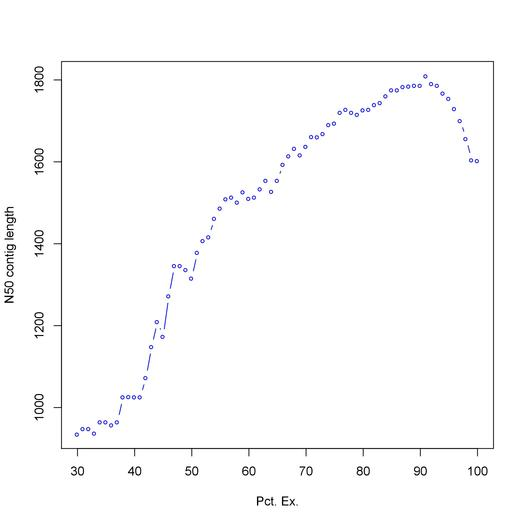

<h1 align="center">Results for the Yeast, Shrimp and Lobster Assemblies</h>

<p>Below are the results generated from the trinity pipeline on marcroni for each of the three assemblies.</p>

<h2 align="center">Yeast Assembly</h2>

<p>A small set of of RNA seq data used to construct a trinity assembly from samples from four conditions with no replicates.</p>

<h3 align="center">Assembly Quality</h3>
<p>Below are the stats basic stats for the yeast trinity assembly including the N50 statistic</p>
```
################################
## Counts of transcripts, etc.
################################
Total trinity 'genes':  8698
Total trinity transcripts:	9245
Percent GC: 38.09

########################################
Stats based on ALL transcript contigs:
########################################

        Contig N10: 3196
        Contig N20: 2601
        Contig N30: 2173
        Contig N40: 1861
        Contig N50: 1603

        Median contig length: 740
        Average contig: 1022.39
        Total assembled bases: 9452030


#####################################################
## Stats based on ONLY LONGEST ISOFORM per 'GENE':
#####################################################

        Contig N10: 3194
        Contig N20: 2599
        Contig N30: 2174
        Contig N40: 1869
        Contig N50: 1603

        Median contig length: 717
        Average contig: 1011.08
        Total assembled bases: 8794382
```
<p>Next the graph depicting the Ex90N50 statistic suggesting that deep enough sequencing was achieved to construct the assembly</p>

<p align="center">
   
</p>


