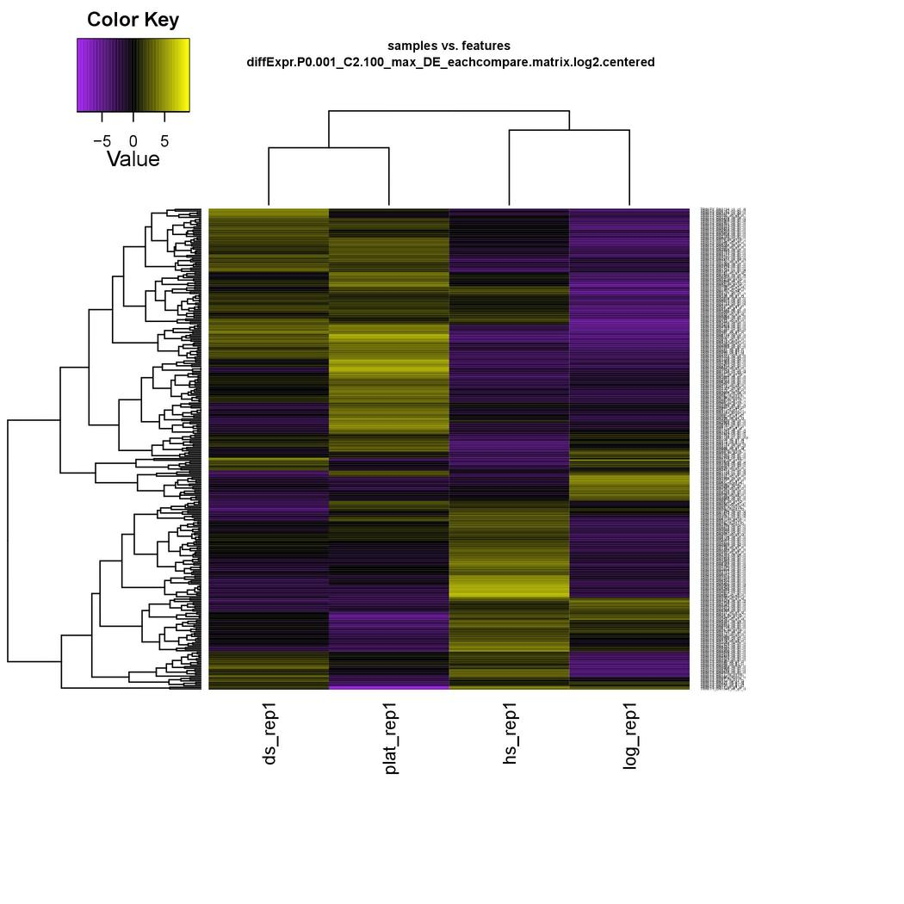

<h1 align="center">Results for the Yeast, Shrimp and Lobster Assemblies</h1>

<p>Below are the results generated from the trinity pipeline on marcroni for each of the three assemblies.</p>

<h2 align="center">Yeast Assembly</h2>

<p>A small set of of RNA seq data used to construct a trinity assembly from samples from four conditions with no replicates.</p>

<h3 align="center">Assembly Quality</h3>
<p>Below are the stats basic stats for the yeast trinity assembly including the N50 statistic</p>
```
################################
## Counts of transcripts, etc.
################################
Total trinity 'genes':  8698
Total trinity transcripts:	9245
Percent GC: 38.09

########################################
Stats based on ALL transcript contigs:
########################################

        Contig N10: 3196
        Contig N20: 2601
        Contig N30: 2173
        Contig N40: 1861
        Contig N50: 1603

        Median contig length: 740
        Average contig: 1022.39
        Total assembled bases: 9452030


#####################################################
## Stats based on ONLY LONGEST ISOFORM per 'GENE':
#####################################################

        Contig N10: 3194
        Contig N20: 2599
        Contig N30: 2174
        Contig N40: 1869
        Contig N50: 1603

        Median contig length: 717
        Average contig: 1011.08
        Total assembled bases: 8794382
```
<p>Next the graph depicting the Ex90N50 statistic suggesting that deep enough sequencing was achieved to construct the assembly</p>

<p align="center">
   
</p>

<h3 align="center">Alignment Statistics</h3>

<p>Below are the alignment rates of the reads from each of the samples to the trinity assembly</p>

```
ds reads
1000000 reads; of these:
  1000000 (100.00%) were paired; of these:
    74023 (7.40%) aligned concordantly 0 times
    811523 (81.15%) aligned concordantly exactly 1 time
    114454 (11.45%) aligned concordantly >1 times
    ----
    74023 pairs aligned concordantly 0 times; of these:
      9992 (13.50%) aligned discordantly 1 time
    ----
    64031 pairs aligned 0 times concordantly or discordantly; of these:
      128062 mates make up the pairs; of these:
        99862 (77.98%) aligned 0 times
        21441 (16.74%) aligned exactly 1 time
        6759 (5.28%) aligned >1 times
95.01% overall alignment rate

hs reads
1000000 reads; of these:
  1000000 (100.00%) were paired; of these:
    72134 (7.21%) aligned concordantly 0 times
    790420 (79.04%) aligned concordantly exactly 1 time
    137446 (13.74%) aligned concordantly >1 times
    ----
    72134 pairs aligned concordantly 0 times; of these:
      8381 (11.62%) aligned discordantly 1 time
    ----
    63753 pairs aligned 0 times concordantly or discordantly; of these:
      127506 mates make up the pairs; of these:
        98520 (77.27%) aligned 0 times
        21950 (17.21%) aligned exactly 1 time
        7036 (5.52%) aligned >1 times
95.07% overall alignment rate

log reads
1000000 reads; of these:
  1000000 (100.00%) were paired; of these:
    78228 (7.82%) aligned concordantly 0 times
    783620 (78.36%) aligned concordantly exactly 1 time
    138152 (13.82%) aligned concordantly >1 times
    ----
    78228 pairs aligned concordantly 0 times; of these:
      10453 (13.36%) aligned discordantly 1 time
    ----
    67775 pairs aligned 0 times concordantly or discordantly; of these:
      135550 mates make up the pairs; of these:
        105156 (77.58%) aligned 0 times
        23562 (17.38%) aligned exactly 1 time
        6832 (5.04%) aligned >1 times
94.74% overall alignment rate

plat reads
1000000 reads; of these:
  1000000 (100.00%) were paired; of these:
    76864 (7.69%) aligned concordantly 0 times
    822698 (82.27%) aligned concordantly exactly 1 time
    100438 (10.04%) aligned concordantly >1 times
    ----
    76864 pairs aligned concordantly 0 times; of these:
      10743 (13.98%) aligned discordantly 1 time
    ----
    66121 pairs aligned 0 times concordantly or discordantly; of these:
      132242 mates make up the pairs; of these:
        100536 (76.02%) aligned 0 times
        25258 (19.10%) aligned exactly 1 time
        6448 (4.88%) aligned >1 times
94.97% overall alignment rate
```
<h3 align="center">Strand Specificity</h3>

<p>Violin plot suggesting that library construction was performed in a strand specific fashion</p>

<p align="center">
  
</p>

<h3 align="center">Differential Expression and Annotations</h3>

<p>Below are the MA and volcano plots for visualizing the differentially expressed isoforms between each of the pairwise comparisons and annotation statistics for the obtained differentially expressed isoforms.  The uniprot and trembl databases were used for the annotations.</p>

<h4 align="center">ds versus hs</h4>

<p align="center">
  
  
</p>

<p>Blastp functional annotations were obtained for 86 of the 94 differentially expressed isoforms in this group</p>

<h4 align="center">ds versus log</h4>

<p align="center">
  
  
</p>

<p>Blastp functional annotations were obtained for 99 of the top 100 differentially expressed isoforms in this group</p>

<h4 align="center">ds versus plat</h4>

<p align="center">
  
  
</p>

<p>Blastp functional annotations were obtained for 68 of the 77 differentially expressed isoforms in this group</p>

<h4 align="center">hs versus log</h4>

<p align="center">
  
  
</p>

<p>Blastp functional annotations were obtained for 94 of the top 100 differentially expressed isoforms in this group</p>

<h4 align="center">hs versus plat</h4>

<p align="center">
  
  
</p>

<p>Blastp functional annotations were obtained for 98 of the top 100 differentially expressed isoforms in this group</p>

<h4 align="center">log versus plat</h4>

<p align="center">
  
  
</p>

<p>Blastp functional annotations were obtained for 97 of the top 100 differentially expressed isoforms in this group</p>

<h4 align="center">Heatmaps for Determining Cluster Extractions</h4>

<p>Below is the heatmap to help visualize isoform clusters of interest.</p>

<p align="center">
  
</p>

<h2 align="center">Shrimp Assembly</h2>

<p>Since most of the results for the shrimp data are shown in the building of the assembly I will not repost them here.  However, a third database was used to try to recover more functional annotations for the differentially expressed isoforms.  The non redundant NCBI data was used for this purpose. Using the uniprot, trembl and nr databases functional annotations were obtained for 9411 of the 16836 differenially expressed isoforms.</p>

<h2 align="center">Lobster Assembly</h2>

<p>An assembly of the cardiac ganglion region represented by three sets of samples each containing four biological replicates with a combined total of ~250 million reads.  Note that a smaller set of samples was then mapped to the assembly.</p>

<h3 align="center">Assembly Quality</h3>

<p>Below are the basic trinity assembly statistics including the N50 statistic.</p>

```
################################
## Counts of transcripts, etc.
################################
Total trinity 'genes':  124393
Total trinity transcripts:	200714
Percent GC: 40.83

########################################
Stats based on ALL transcript contigs:
########################################

        Contig N10: 7807
        Contig N20: 5665
        Contig N30: 4401
        Contig N40: 3425
        Contig N50: 2631

        Median contig length: 651
        Average contig: 1370.51
        Total assembled bases: 275080373


#####################################################
## Stats based on ONLY LONGEST ISOFORM per 'GENE':
#####################################################

        Contig N10: 5941
        Contig N20: 4012
        Contig N30: 2825
        Contig N40: 1986
        Contig N50: 1359

        Median contig length: 524
        Average contig: 943.69
        Total assembled bases: 117389051
```
<p>Next a graph of the Ex90N50 statistic which suggests adequate sequencing depth for the assembly</p>

<p align="center">
  
</p>

<h3 align="center">Alignment Statistics</h3>

<p>By aligning each group of replicates back to the assembly with various parameters it was discovered that a majority of the reads aligned in a dove tail fashion.  The dove tail option was enabled in bowtie2 to allow these alignments to count as concordant alignments to generate the following statistics.</p>

<h4 align="center">Pre Motor Neuron Region (PMN)</h4>

```
PMN1 
16406619 reads; of these:
  16406619 (100.00%) were paired; of these:
    1359501 (8.29%) aligned concordantly 0 times
    1291384 (7.87%) aligned concordantly exactly 1 time
    13755734 (83.84%) aligned concordantly >1 times
    ----
    1359501 pairs aligned concordantly 0 times; of these:
      8526 (0.63%) aligned discordantly 1 time
    ----
    1350975 pairs aligned 0 times concordantly or discordantly; of these:
      2701950 mates make up the pairs; of these:
        1962997 (72.65%) aligned 0 times
        120596 (4.46%) aligned exactly 1 time
        618357 (22.89%) aligned >1 times
94.02% overall alignment rate

PMN2
16720429 reads; of these:
  16720429 (100.00%) were paired; of these:
    1217375 (7.28%) aligned concordantly 0 times
    1156021 (6.91%) aligned concordantly exactly 1 time
    14347033 (85.81%) aligned concordantly >1 times
    ----
    1217375 pairs aligned concordantly 0 times; of these:
      5839 (0.48%) aligned discordantly 1 time
    ----
    1211536 pairs aligned 0 times concordantly or discordantly; of these:
      2423072 mates make up the pairs; of these:
        1807366 (74.59%) aligned 0 times
        93945 (3.88%) aligned exactly 1 time
        521761 (21.53%) aligned >1 times
94.60% overall alignment rate

PMN3
15347192 reads; of these:
  15347192 (100.00%) were paired; of these:
    1169191 (7.62%) aligned concordantly 0 times
    1072063 (6.99%) aligned concordantly exactly 1 time
    13105938 (85.40%) aligned concordantly >1 times
    ----
    1169191 pairs aligned concordantly 0 times; of these:
      6303 (0.54%) aligned discordantly 1 time
    ----
    1162888 pairs aligned 0 times concordantly or discordantly; of these:
      2325776 mates make up the pairs; of these:
        1680072 (72.24%) aligned 0 times
        95676 (4.11%) aligned exactly 1 time
        550028 (23.65%) aligned >1 times
94.53% overall alignment rate

PMN4
16003783 reads; of these:
  16003783 (100.00%) were paired; of these:
    1298839 (8.12%) aligned concordantly 0 times
    1304864 (8.15%) aligned concordantly exactly 1 time
    13400080 (83.73%) aligned concordantly >1 times
    ----
    1298839 pairs aligned concordantly 0 times; of these:
      7573 (0.58%) aligned discordantly 1 time
    ----
    1291266 pairs aligned 0 times concordantly or discordantly; of these:
      2582532 mates make up the pairs; of these:
        1967826 (76.20%) aligned 0 times
        110471 (4.28%) aligned exactly 1 time
        504235 (19.52%) aligned >1 times
93.85% overall alignment rate
```
<h4 align="center">Motor Neuron Region (MN)</h4>

```
MN1
18501852 reads; of these:
  18501852 (100.00%) were paired; of these:
    1282737 (6.93%) aligned concordantly 0 times
    1681256 (9.09%) aligned concordantly exactly 1 time
    15537859 (83.98%) aligned concordantly >1 times
    ----
    1282737 pairs aligned concordantly 0 times; of these:
      8068 (0.63%) aligned discordantly 1 time
    ----
    1274669 pairs aligned 0 times concordantly or discordantly; of these:
      2549338 mates make up the pairs; of these:
        1905055 (74.73%) aligned 0 times
        117648 (4.61%) aligned exactly 1 time
        526635 (20.66%) aligned >1 times
94.85% overall alignment rate

MN2
18526931 reads; of these:
  18526931 (100.00%) were paired; of these:
    1418912 (7.66%) aligned concordantly 0 times
    1722893 (9.30%) aligned concordantly exactly 1 time
    15385126 (83.04%) aligned concordantly >1 times
    ----
    1418912 pairs aligned concordantly 0 times; of these:
      8769 (0.62%) aligned discordantly 1 time
    ----
    1410143 pairs aligned 0 times concordantly or discordantly; of these:
      2820286 mates make up the pairs; of these:
        2137120 (75.78%) aligned 0 times
        125512 (4.45%) aligned exactly 1 time
        557654 (19.77%) aligned >1 times
94.23% overall alignment rate

MN3
16505455 reads; of these:
  16505455 (100.00%) were paired; of these:
    1057999 (6.41%) aligned concordantly 0 times
    1434022 (8.69%) aligned concordantly exactly 1 time
    14013434 (84.90%) aligned concordantly >1 times
    ----
    1057999 pairs aligned concordantly 0 times; of these:
      8123 (0.77%) aligned discordantly 1 time
    ----
    1049876 pairs aligned 0 times concordantly or discordantly; of these:
      2099752 mates make up the pairs; of these:
        1519490 (72.37%) aligned 0 times
        105291 (5.01%) aligned exactly 1 time
        474971 (22.62%) aligned >1 times
95.40% overall alignment rate

MN4
15214989 reads; of these:
  15214989 (100.00%) were paired; of these:
    1168927 (7.68%) aligned concordantly 0 times
    1365786 (8.98%) aligned concordantly exactly 1 time
    12680276 (83.34%) aligned concordantly >1 times
    ----
    1168927 pairs aligned concordantly 0 times; of these:
      8200 (0.70%) aligned discordantly 1 time
    ----
    1160727 pairs aligned 0 times concordantly or discordantly; of these:
      2321454 mates make up the pairs; of these:
        1677403 (72.26%) aligned 0 times
        111941 (4.82%) aligned exactly 1 time
        532110 (22.92%) aligned >1 times
94.49% overall alignment rate
```

<h4 align="center">Cardiac Ganglion Region (CG)</h4>

```
CG1
15093492 reads; of these:
  15093492 (100.00%) were paired; of these:
    981591 (6.50%) aligned concordantly 0 times
    1264962 (8.38%) aligned concordantly exactly 1 time
    12846939 (85.12%) aligned concordantly >1 times
    ----
    981591 pairs aligned concordantly 0 times; of these:
      7242 (0.74%) aligned discordantly 1 time
    ----
    974349 pairs aligned 0 times concordantly or discordantly; of these:
      1948698 mates make up the pairs; of these:
        1418226 (72.78%) aligned 0 times
        95358 (4.89%) aligned exactly 1 time
        435114 (22.33%) aligned >1 times
95.30% overall alignment rate

CG2
22305355 reads; of these:
  22305355 (100.00%) were paired; of these:
    1418901 (6.36%) aligned concordantly 0 times
    1753756 (7.86%) aligned concordantly exactly 1 time
    19132698 (85.78%) aligned concordantly >1 times
    ----
    1418901 pairs aligned concordantly 0 times; of these:
      9647 (0.68%) aligned discordantly 1 time
    ----
    1409254 pairs aligned 0 times concordantly or discordantly; of these:
      2818508 mates make up the pairs; of these:
        2010649 (71.34%) aligned 0 times
        136395 (4.84%) aligned exactly 1 time
        671464 (23.82%) aligned >1 times
95.49% overall alignment rate

CG3
15647907 reads; of these:
  15647907 (100.00%) were paired; of these:
    1311459 (8.38%) aligned concordantly 0 times
    1236134 (7.90%) aligned concordantly exactly 1 time
    13100314 (83.72%) aligned concordantly >1 times
    ----
    1311459 pairs aligned concordantly 0 times; of these:
      6575 (0.50%) aligned discordantly 1 time
    ----
    1304884 pairs aligned 0 times concordantly or discordantly; of these:
      2609768 mates make up the pairs; of these:
        2036140 (78.02%) aligned 0 times
        96208 (3.69%) aligned exactly 1 time
        477420 (18.29%) aligned >1 times
93.49% overall alignment rate

CG4
21782664 reads; of these:
  21782664 (100.00%) were paired; of these:
    1660688 (7.62%) aligned concordantly 0 times
    1981441 (9.10%) aligned concordantly exactly 1 time
    18140535 (83.28%) aligned concordantly >1 times
    ----
    1660688 pairs aligned concordantly 0 times; of these:
      10451 (0.63%) aligned discordantly 1 time
    ----
    1650237 pairs aligned 0 times concordantly or discordantly; of these:
      3300474 mates make up the pairs; of these:
        2518778 (76.32%) aligned 0 times
        149697 (4.54%) aligned exactly 1 time
        631999 (19.15%) aligned >1 times
94.22% overall alignment rate
```

<h3 align="center">Comparison of Replicates and Principle Components</h3>

<h4 align="center">PMN Replicate Comparisons</h4>

<p align="center">
  
  
</p>

<p align="center">
  
  
</p>

<h4 align="center">MN Replicate Comparisons</h4>

<p align="center">
  
  
</p>

<p align="center">
  
  
</p>


<h4 align="center">CG Replicate Comparisons</h4>

<p align="center">
  
  
</p>

<p align="center">
  
  
</p>

